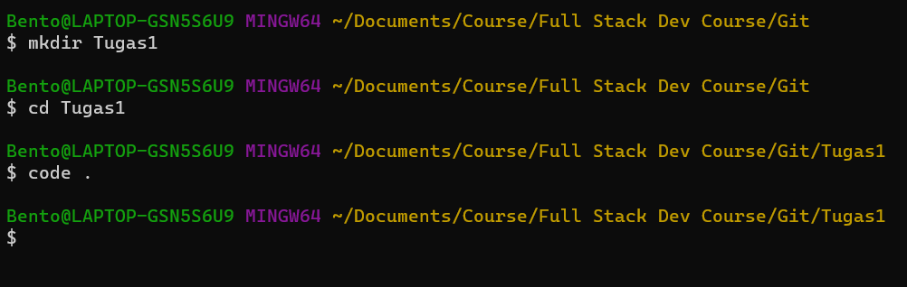
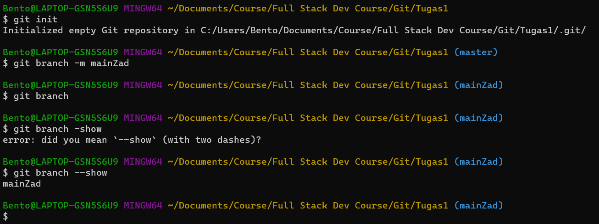
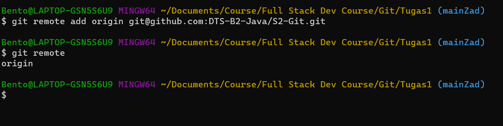
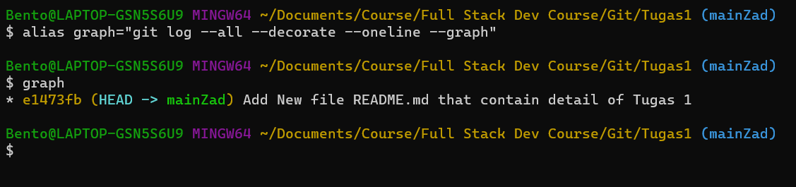
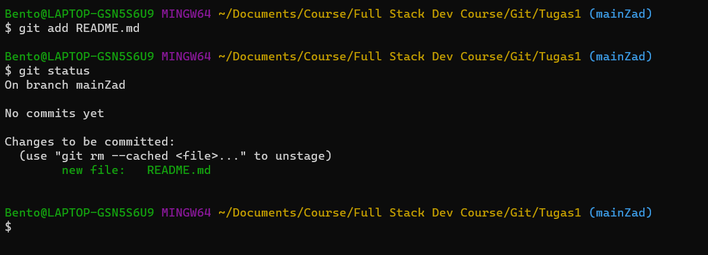
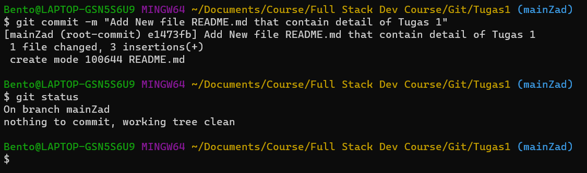
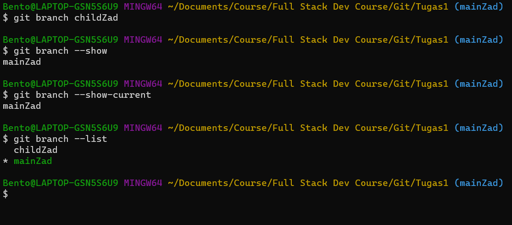
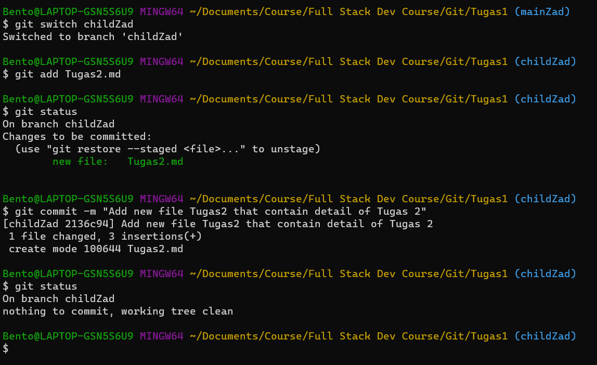
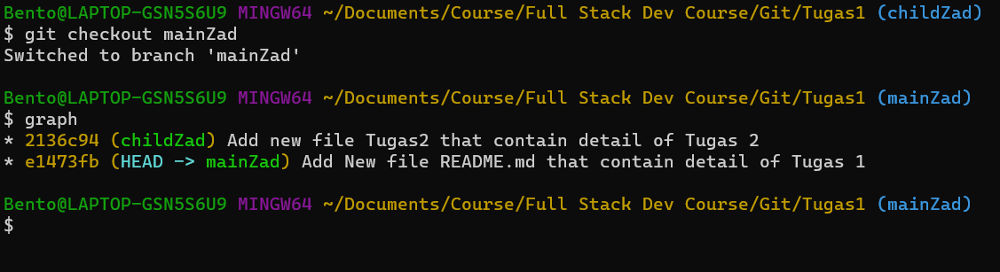
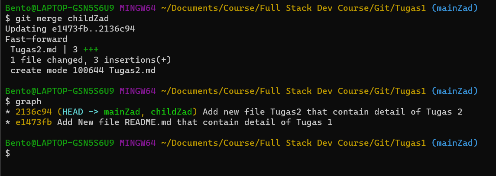

# Tugas 1

# 1. Silahkan teman2 implementasi apa yang sudah dipelajari terkait git dari initial git, dll

# mkdir

# git init

# add remote

# add alias

# add readme

# commit 1

# add new branch

# switch to new branch

# log before ff merge

# ff merge

