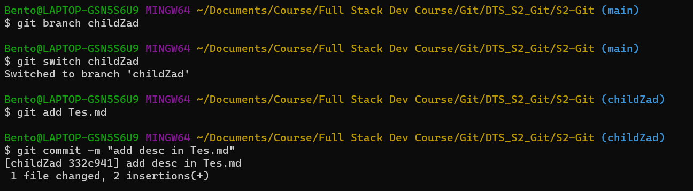
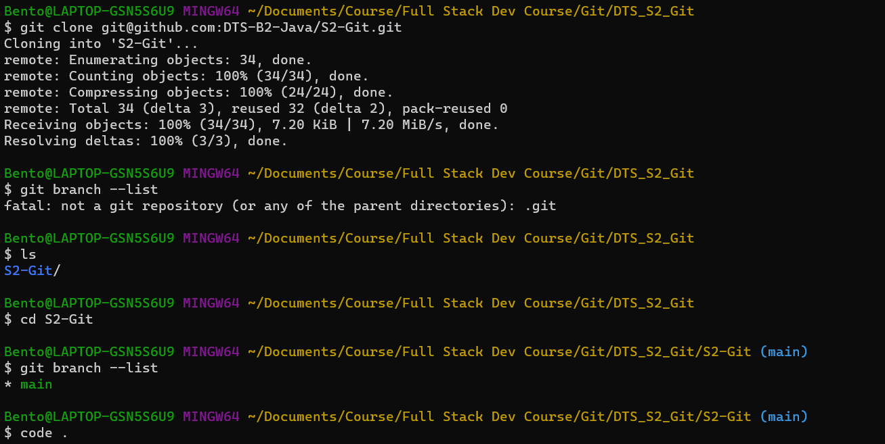
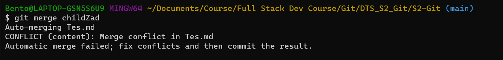
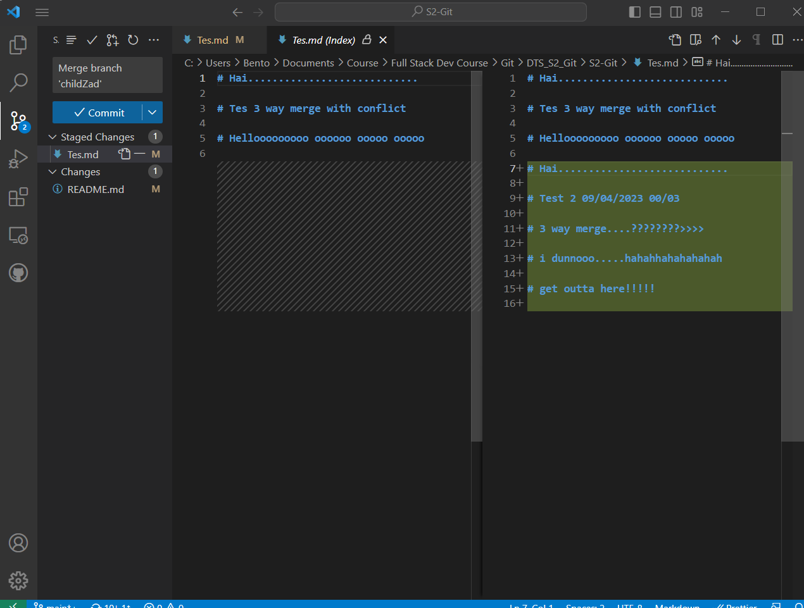
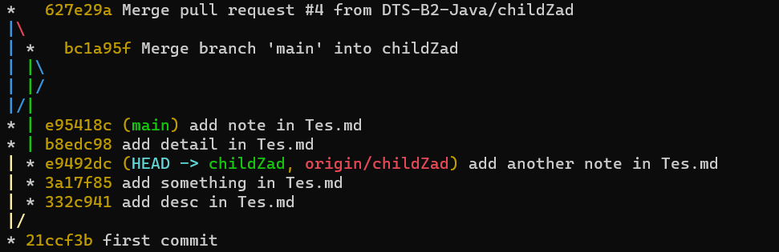
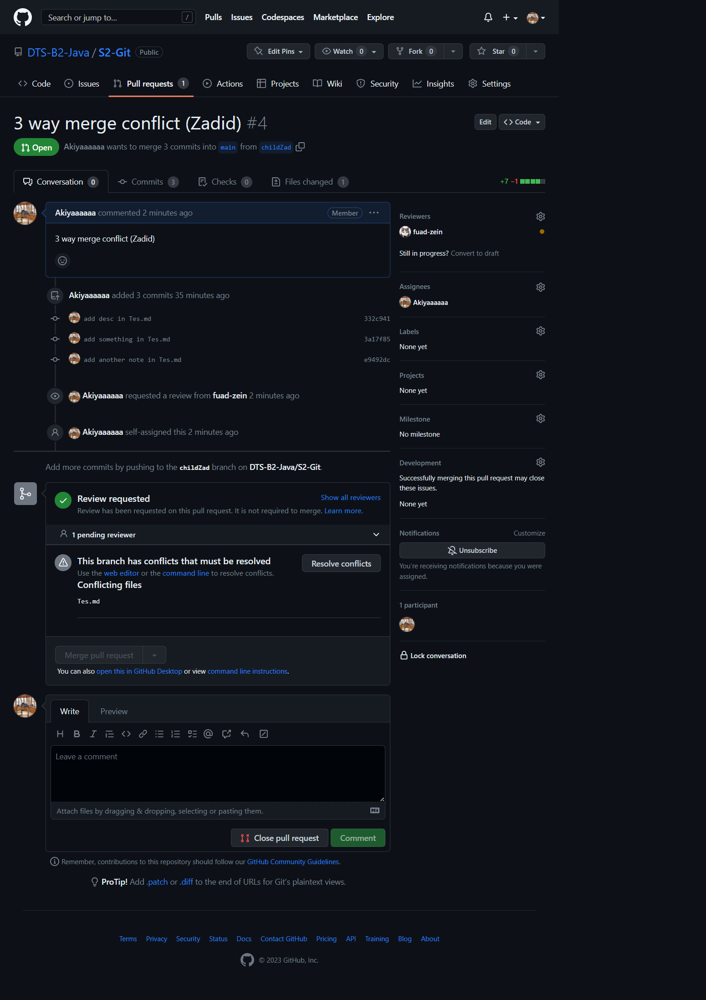
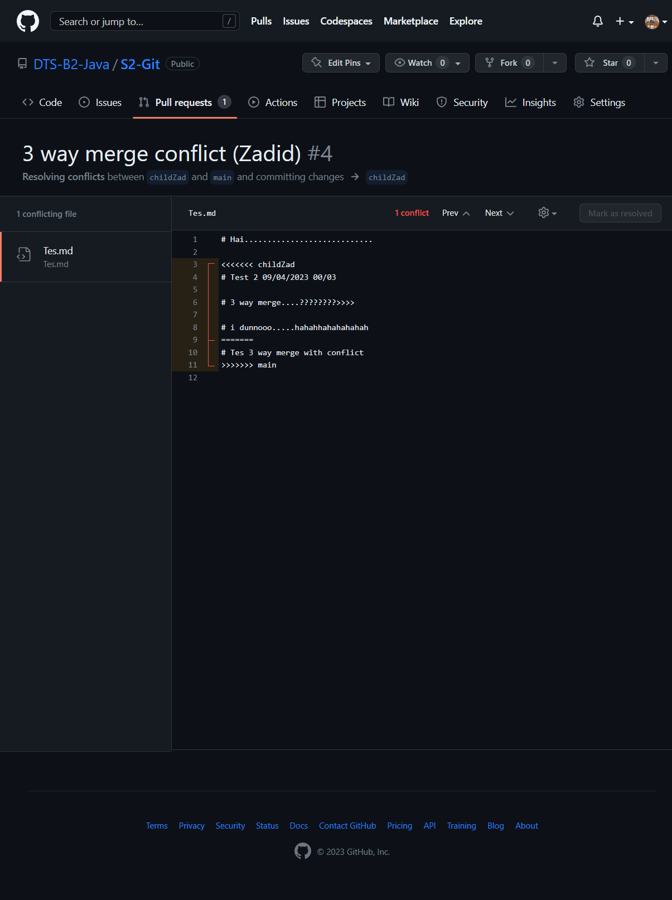
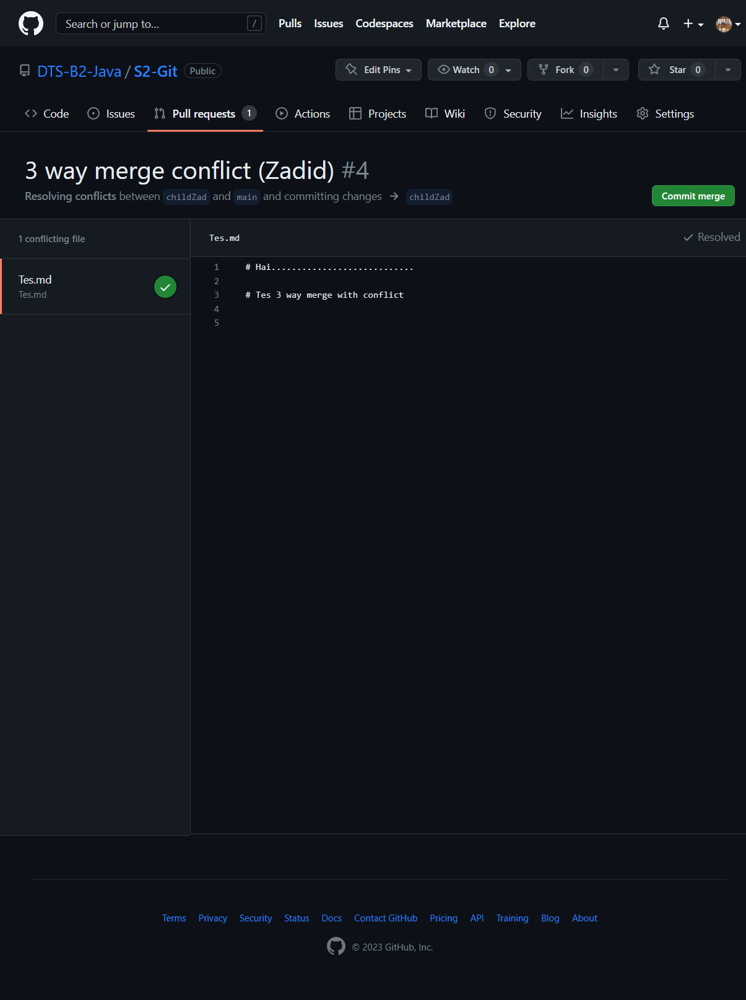
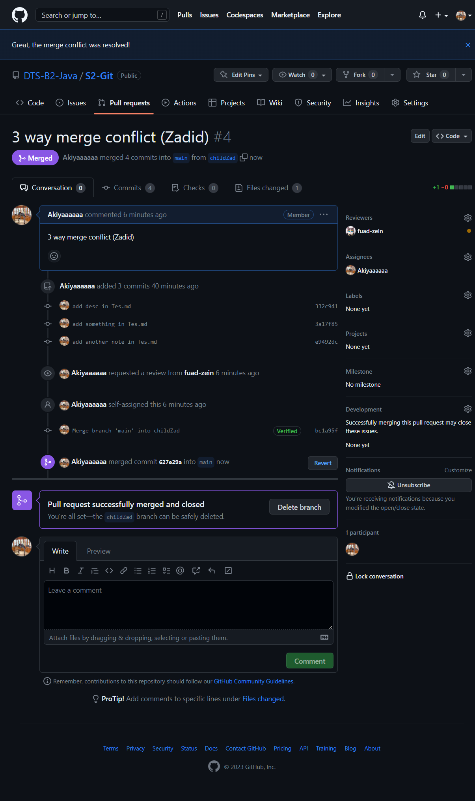

# Tugas 1

# 1. Silahkan teman2 implementasi apa yang sudah dipelajari terkait git dari initial git, dll

# mkdir

# git init

# add remote

# add alias

# add readme

# commit 1

# add new branch

# 2. Silahkan membuat skenario Fast-Forward dengan membuat branch Parent : ex. MainFuad => Child : ex. Fuad (lakukan merge secara langsung dari terminal dengan menambahkan remote dari repository organization S2-Git)

# switch to new branch

# log before ff merge

# ff merge

# 3. Three Way Merge dan solved conflict pada git, dengan merge untuk Three Way Merging dengan cara pull request dengan review akun @fuad dan assign jangan lupa

# prepare 3-way_merge

# git clone

# ==========================================

# 3WM-Terminal

# try 3 way merge-terminal

# resolve 3WM (code editor)

# log for 3WM

# ==========================================

# 3WM Pull Req

# push child branch

# pill request conlict

# conflict

# resolve conflict

# pull request done

