## GIT

# tugas 1

# initial git - add file

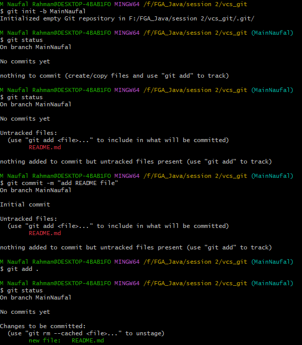

# commit - add remote

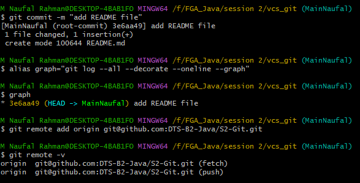

# tugas 2

# create child branch - merge

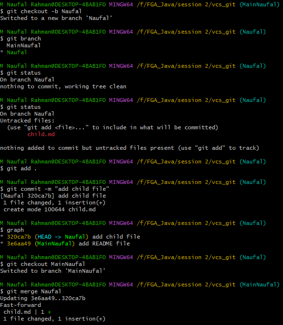

# graph

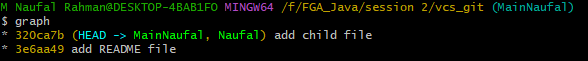

# tugas 3

# clone repository - new branch

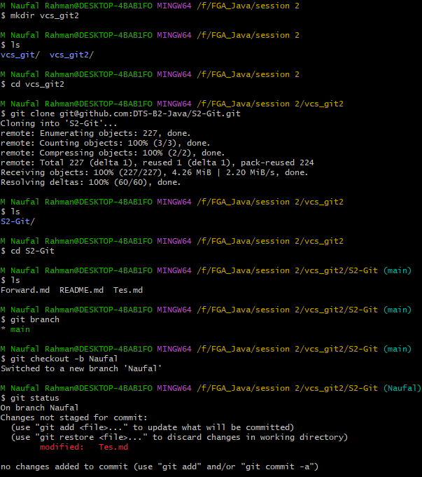

# edit tes file - conflict

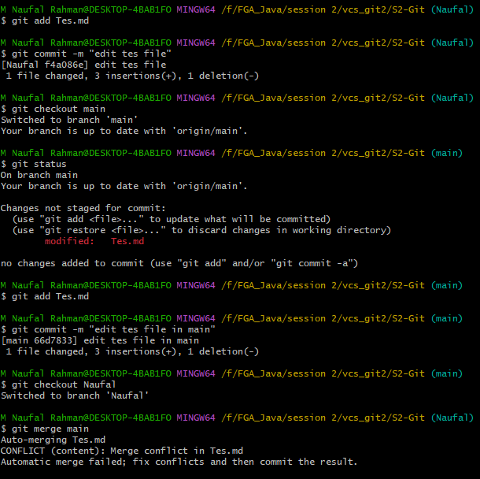

# push branch Naufal

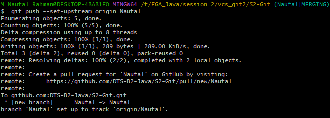

# pull request

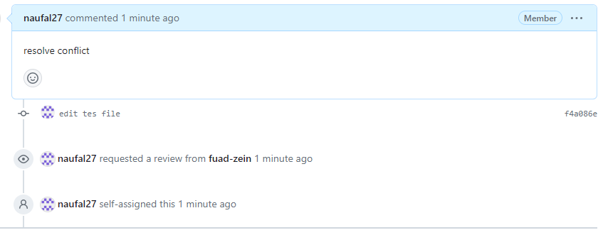
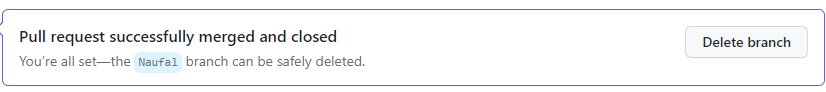

# push after pull request

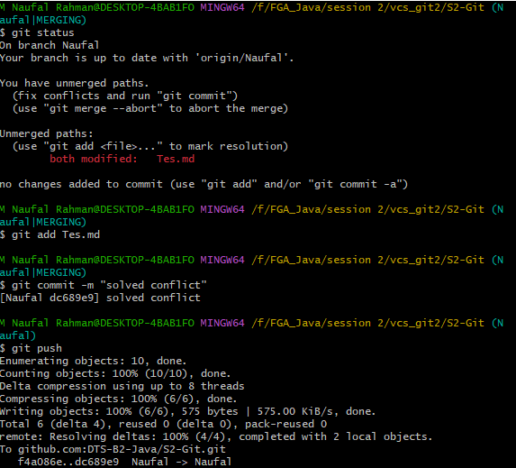

# graph after solved conflict

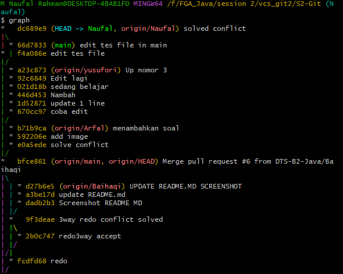
