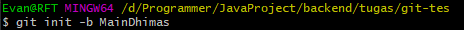

# Tugas Git

## 1. Mengisialisasi git init dengan nama branch MainDhimas pada local

## 2. Melakukan remote repo

## 3. Membuat branch child dengan nama Dhimas

## 4. Mengisialisasi git init pada folder local

