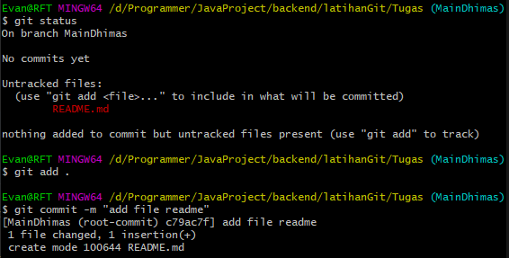
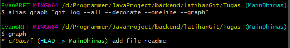

# Tugas Git

## 1. Silahkan teman2 implementasi apa yang sudah dipelajari terkait git dari initial git, dll

### git init

### git status,add,commit

### git graph

### git remote

## 2. Silahkan membuat skenario Fast-Forward dengan membuat branch Parent : ex. MainFuad => Child : ex. Fuad (lakukan merge secara langsung dari terminal dengan menambahkan remote dari repository organization S2-Git)

### add branch child Dhimas

### Fast Forward Merge

## 3. Three Way Merge dan solved conflict pada git, dengan merge untuk Three Way Merging dengan cara pull request dengan review akun @fuad dan assign jangan lupa

### clone repo

## Three Way Merge

### Resolve conflict with code editor

### Resolve conflict with pull request

